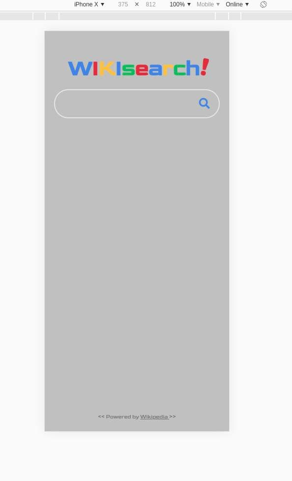
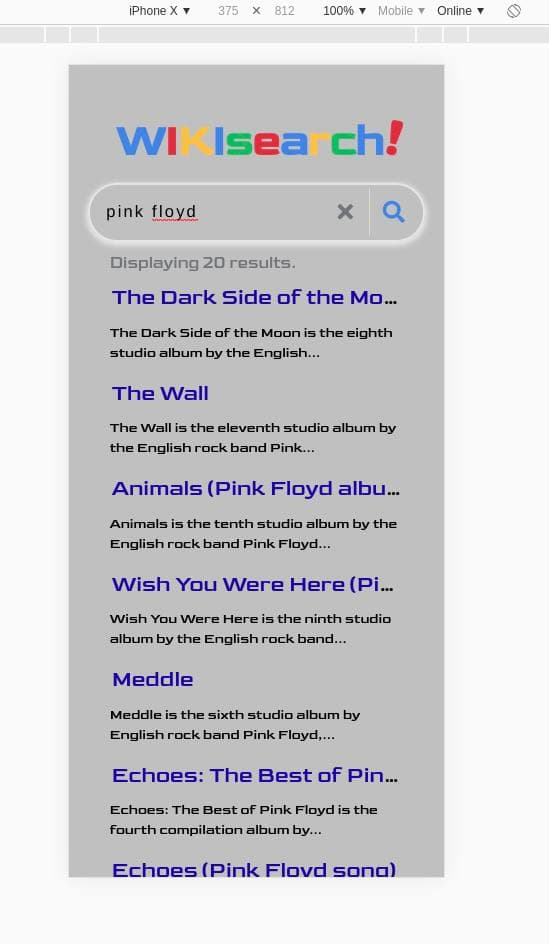
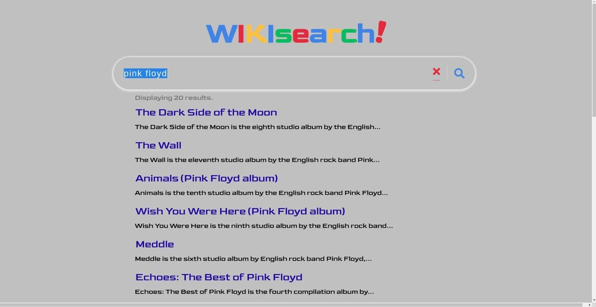

# SearchMeVJS is a vanilla js Searching App using wikipedia API
- After you cloned you have to run the sass using sass --watch sass/style.scss:css/style.css
https://ciamac-da.github.io/SearchMeVJS/.

